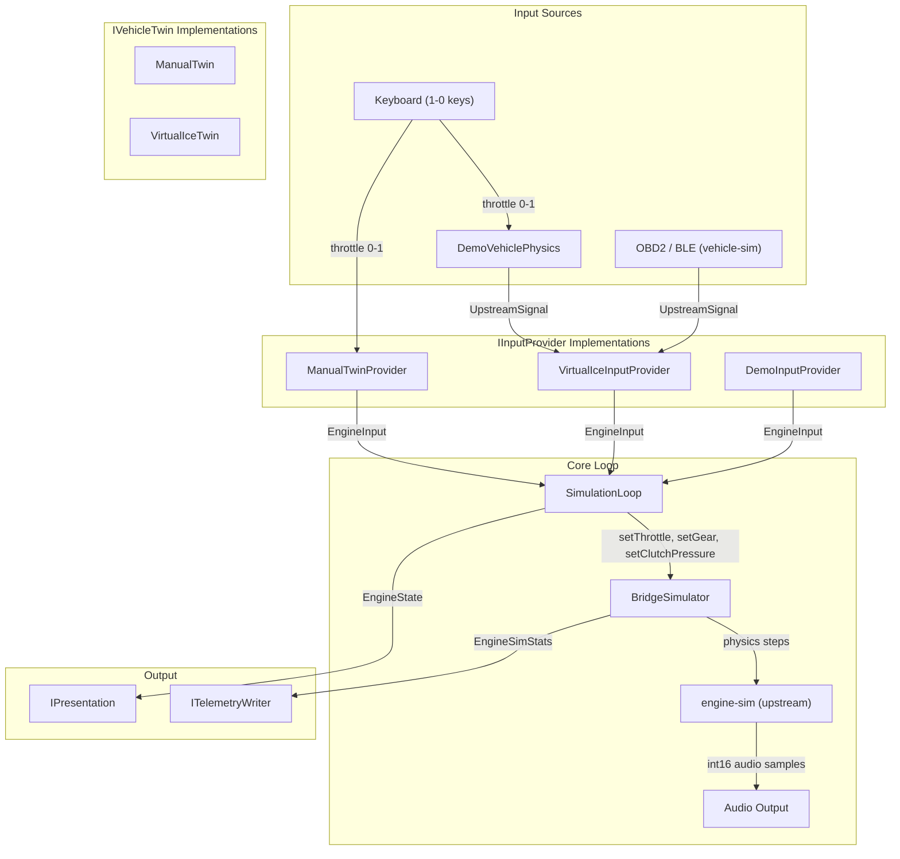
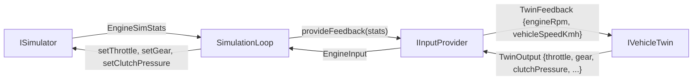
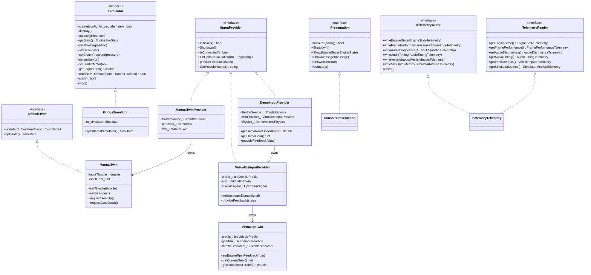
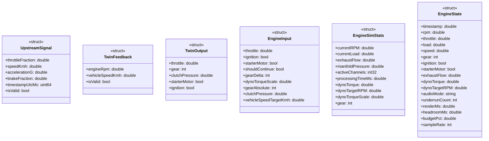
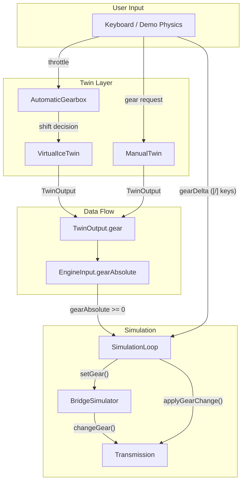
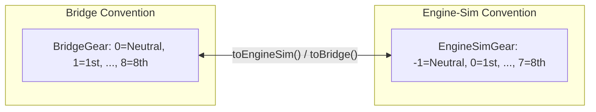
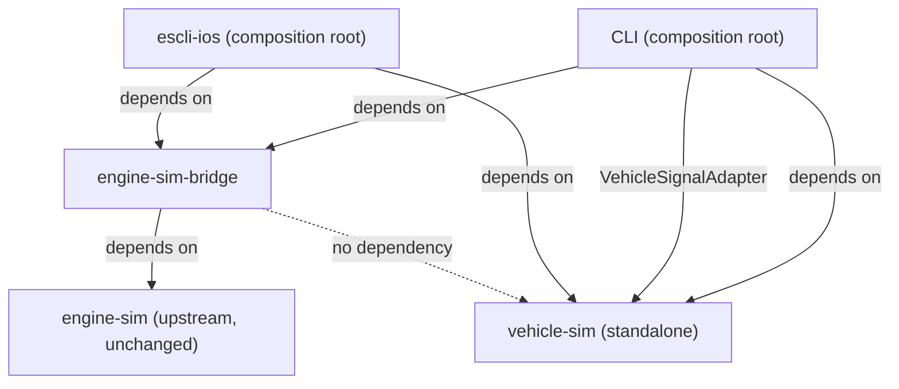
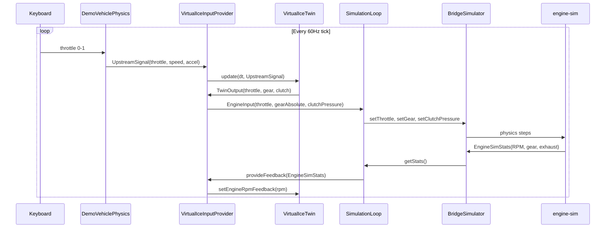

# Component Architecture Diagram

**Date:** 2026-05-12
**Purpose:** Visual reference for the engine-sim-bridge component hierarchy, data flow, and interface contracts.

---

## Main Pipeline

---

## Feedback Loop

---

## Interfaces and Implementations

---

## Data Flow Structs

---

## Gear Selector Flow

---

## Gear Convention Mapping

---

## Dependency Flow (Architecture Boundaries)

**Key constraint:** Neither bridge nor vehicle-sim depends on the other. Both are independent libraries. The composition root (CLI or iOS app) depends on both and writes the adapter.

---

## Demo Mode Data Flow

